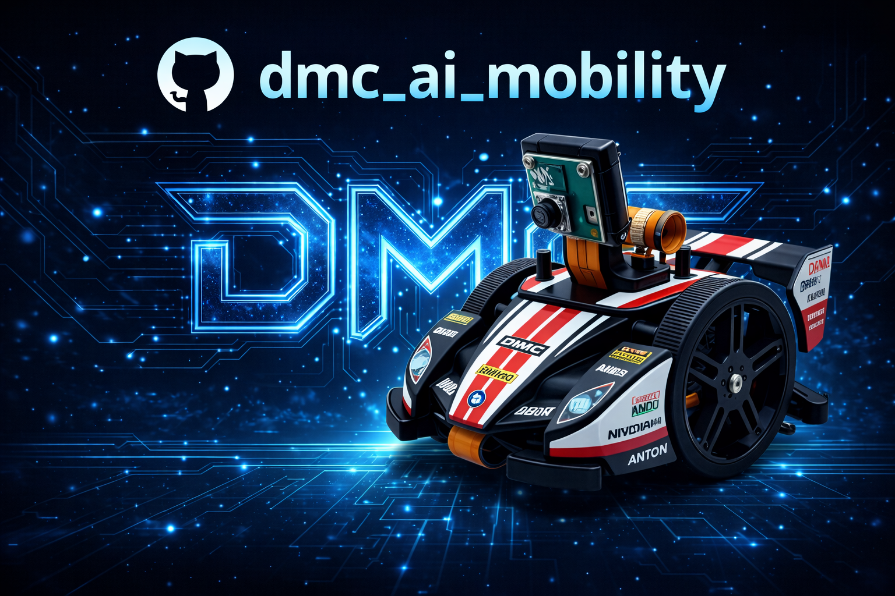

# dmc_ai_mobility



Raspberry Pi OS 上で動作する **AI ロボット制御用 Python ソフトウェア**です。通信基盤に Zenoh を使い、以下を行います。

- motor: 速度指令を Subscribe して走行制御（deadman で安全停止）
- motor telemetry: 現在のパルス幅と最新指令を Publish
- imu: IMU 状態を Publish
- oled: 表示コマンドを Subscribe
- camera: JPEG とメタデータを Publish（任意）

設計の概要は `docs/dmc_ai_mobility_software_design.md` を参照してください。
キャリブレーション手順は `docs/calibration.md` を参照してください。
ドキュメントサイト: https://fooping-tech.github.io/dmc_ai_mobility/

## Quickstart（ハード無し / Zenoh 無し）

開発機で動作確認できる `--dry-run` を用意しています（Zenoh/hardware 依存なし）。

```bash
python3 -m pip install -r requirements.txt
python3 -m pip install -e .
python3 -m unittest discover -s tests

# dry-run 起動（no-camera はログが落ち着くので推奨）
PYTHONPATH=src python3 -m dmc_ai_mobility.app.cli robot \
  --config ./config.toml \
  --robot-id devbot \
  --dry-run \
  --no-camera \
  --log-level INFO
```

ログ例（順不同）:

- `dry-run subscribed dmc_robo/devbot/motor/cmd`
- `dry-run subscribed dmc_robo/devbot/oled/cmd`
- `deadman timeout -> motor stop`

## CLI

`src/dmc_ai_mobility/app/cli.py` が CLI の入口です。

```bash
# robot node
PYTHONPATH=src python3 -m dmc_ai_mobility.app.cli robot --config ./config.toml --dry-run

# health node（ハートビート）
PYTHONPATH=src python3 -m dmc_ai_mobility.app.cli health --config ./config.toml --dry-run
```

## Remote UI

`examples/remote_zenoh_ui.py` は Zenoh 経由の操作 UI です。H.264 の受信映像と、リモート側で再 publish した JPEG（`camera/image/jpeg/remote`）を並べて表示します。

```bash
python3 -m pip install PySide6 pyqtgraph
python3 examples/remote_zenoh_ui.py --robot-id rasp-zero-01 --zenoh-config ./zenoh_remote.json5
```

補足:
- H.264 表示には `ffmpeg` が必要です。

## 設定（config.toml）

`config.toml` を編集します（例は `config.toml` にあります）。

- `robot_id`: Zenoh キーに含まれるロボット識別子
- `[motor].deadman_ms`: 指令が途絶したら停止するまでの ms
- `[motor].deadband_pw`: デッドバンド（パルス幅 1500±x）。両輪が範囲内なら停止（pulsewidth=0）
- `[motor].telemetry_hz`: motor テレメトリ publish 周期（Hz）
- `[imu].publish_hz`: IMU publish 周期（Hz）
- `[oled].max_hz`: OLED 更新上限（Hz）
- `[camera]`: カメラ設定（enable/device/width/height/fps）
- `[lidar]`: LiDAR 設定（enable/port/baudrate/publish_hz/front_window_deg/front_stat）
- `[zenoh].config_path`: Zenoh 設定ファイルへのパス（任意）

## Zenoh キー

命名規則:

`dmc_robo/<robot_id>/<component>/<direction>`

主なキー（詳細は `src/dmc_ai_mobility/zenoh/keys.py`）:

- motor cmd（Subscribe）: `dmc_robo/<robot_id>/motor/cmd`
- motor telemetry（Publish）: `dmc_robo/<robot_id>/motor/telemetry`
- imu state（Publish）: `dmc_robo/<robot_id>/imu/state`
- oled cmd（Subscribe）: `dmc_robo/<robot_id>/oled/cmd`
- camera jpeg（Publish）: `dmc_robo/<robot_id>/camera/image/jpeg`
- camera meta（Publish）: `dmc_robo/<robot_id>/camera/meta`
- lidar scan（Publish）: `dmc_robo/<robot_id>/lidar/scan`
- lidar front（Publish）: `dmc_robo/<robot_id>/lidar/front`

motor cmd payload（JSON）例:

```json
{"v_l":0.10,"v_r":0.12,"unit":"mps","deadman_ms":300,"seq":184,"ts_ms":1735467890123}
```

## systemd（Raspberry Pi）

`systemd/dmc-ai-mobility.service` は配備例です。`/home/fooping/dmc_ai_mobility` と venv `/home/fooping/env` を想定しています。環境に合わせて `WorkingDirectory`、`VIRTUAL_ENV`、`PATH`、`ExecStart` を調整してください。

```bash
cp -r . /home/fooping/dmc_ai_mobility
python3 -m venv /home/fooping/env
/home/fooping/env/bin/pip install -r /home/fooping/dmc_ai_mobility/requirements.txt
sudo cp systemd/dmc-ai-mobility.service /etc/systemd/system/
sudo systemctl daemon-reload
sudo systemctl enable --now dmc-ai-mobility.service
```

## スクリプト

`scripts/run_robot.sh` は `PYTHONPATH` を設定して robot node を起動する簡易ランナーです。

```bash
./scripts/run_robot.sh ./config.toml --dry-run --no-camera --robot-id devbot
```

実機運用では引数なしで起動できます（`./config.toml` をデフォルト設定として使用します）:

```bash
./scripts/run_robot.sh
```

## 開発メモ

- `src/dmc_ai_mobility/app/robot_node.py` が統合ノード（subscribe/publish/deadman）です。
- 実機ドライバは環境依存です（例: `pigpio`, `mpu9250_jmdev`, `opencv-python`, `eclipse-zenoh`, `adafruit-circuitpython-ssd1306`）。
- 依存は `pyproject.toml` の optional extras に分けています。

## よくあるログ: `camera read failed`

`camera read failed` は OpenCV (`cv2.VideoCapture`) がフレームを取得できていない状態です（デバイス未認識、権限、libcamera/libcamerify 未設定など）。

- 一旦カメラ無しで起動: `./scripts/run_robot.sh ./config.toml --no-camera`
- `/dev/video*` が出ているか確認（Raspberry Pi + libcamera 構成の場合は `libcamerify` が必要なことがあります）

### libcamerify が必要な環境

`examples/example_camera.py` が `libcamerify python3 ...` で動く環境では、本体も `libcamerify` 経由で起動する必要があります。

- `scripts/run_robot.sh` は `libcamerify` が見つかる場合は自動で `libcamerify` 経由で起動します（無効化したい場合は `DMC_USE_LIBCAMERIFY=0`）。
- systemd も `libcamerify` が存在すれば自動で使用するようにしてあります（`systemd/dmc-ai-mobility.service`）。

## requirements.txt のインストール

このリポジトリには `requirements.txt` も用意しています。

```bash
python3 -m pip install -r requirements.txt
```
