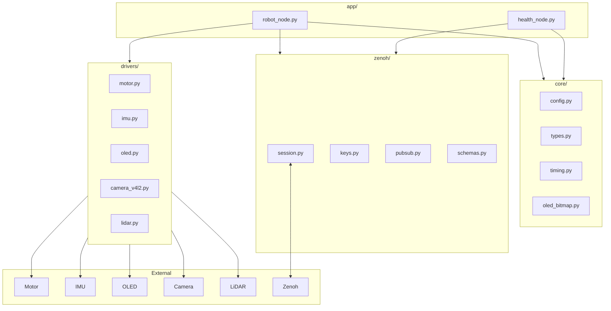

# ソフト構造

`dmc_ai_mobility` の主要モジュール構成を Mermaid で表現します。

```mermaid
flowchart TB
  subgraph App["app/"]
    robot_node["robot_node.py"]
    health_node["health_node.py"]
  end

  subgraph Core["core/"]
    config["config.py"]
    types["types.py"]
    timing["timing.py"]
    oled_bitmap["oled_bitmap.py"]
  end

  subgraph Drivers["drivers/"]
    motor["motor.py"]
    imu["imu.py"]
    oled["oled.py"]
    camera["camera_v4l2.py"]
    lidar["lidar.py"]
  end

  subgraph Zenoh["zenoh/"]
    session["session.py"]
    keys["keys.py"]
    pubsub["pubsub.py"]
    schemas["schemas.py"]
  end

  robot_node --> Drivers
  robot_node --> Core
  robot_node --> Zenoh
  health_node --> Zenoh
  health_node --> Core

  subgraph External["External"]
    motor_hw["Motor"]
    imu_hw["IMU"]
    oled_hw["OLED"]
    camera_hw["Camera"]
    lidar_hw["LiDAR"]
    zenoh_net["Zenoh"]
  end

  Drivers --> motor_hw
  Drivers --> imu_hw
  Drivers --> oled_hw
  Drivers --> camera_hw
  Drivers --> lidar_hw
  session <--> zenoh_net
```
